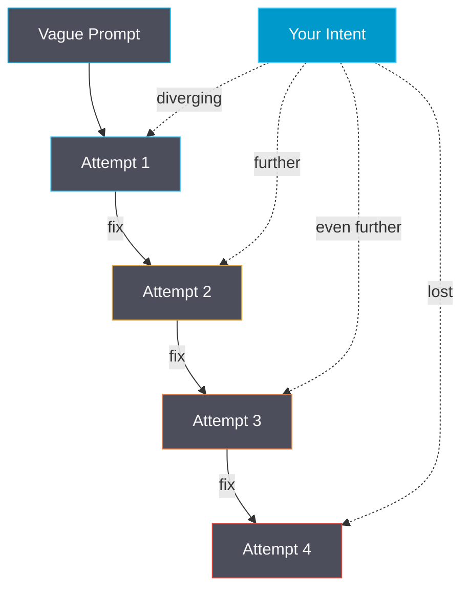
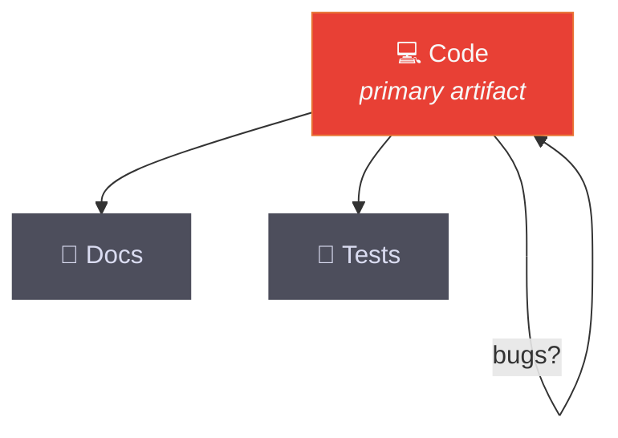
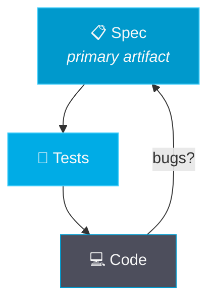
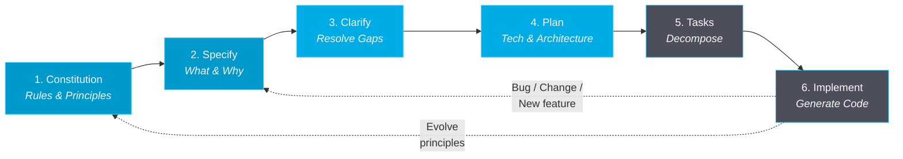

<p class="text-regent-secondary text-base tracking-wide opacity-80">CLAUDE.md rules and plan mode only get you so far</p>

<h1 class="text-regent-light !text-5xl font-bold !leading-tight !mb-2 !mt-4">Spec-Driven Development</h1>

<p class="text-regent-secondary text-xl">Making Intent the Source of Truth</p>

<p class="text-regent-secondary text-sm opacity-60 mt-auto">
  Mikael Pettersson &middot; Competence Conference 2026
</p>

<div class="absolute bottom-12 right-8 flex flex-col items-center gap-1">
  <AudienceQrCode :size="140" />
  <p class="text-regent-secondary text-xs opacity-70">Scan to join</p>
</div>

<!--
- Open with the pain: "Who uses CLAUDE.md / .cursorrules / rules files?" → hands up
- "Plan mode? Tickets?" → most hands
- "And how often does the AI actually build what you wanted?" → knowing looks
- You're ahead of most teams — but these tools still leave a gap
- Today: how to close that gap with one practice — write specs before code
- QR code in corner — scan while settling in for live polls and Q&A
-->

---

# Rules, plans, and tickets leave a gap

<div class="mt-2">

<v-click>

<div class="grid grid-cols-3 gap-4 text-sm">

<div class="p-3 rounded bg-regent-master">

### Rules files
<div class="text-regent-secondary mt-1">

CLAUDE.md, .cursorrules, copilot-instructions...

- Tell AI **how** to code
- Can include quality rules
- But enforcement is **best-effort**
- AI may forget or deprioritize

</div>
</div>

<div class="p-3 rounded bg-regent-master">

### Tickets + Plan mode
<div class="text-regent-secondary mt-1">

Jira, GH Issues, plan mode...

- Describe **work items**
- Plans help thinking but are **ephemeral**
- AI interprets differently each time
- No structured validation step

</div>
</div>

<div class="p-3 rounded bg-regent-master border border-dashed border-regent-cyan/50">

### ???
<div class="text-regent-secondary mt-1">

The missing layer

- Defines **what** and **why**
- Quality gates that **block**, not suggest
- Compliance checked at every step
- Traceable: intent → code

</div>
</div>

</div>

</v-click>

<v-click>

<div class="mt-3 p-3 rounded bg-regent-master border-l-4 border-regent-cyan text-sm">

**They're good tools — but there's a gap.** Rules tell AI *how* to code. Tickets say *what* to work on. Nothing structurally ensures the AI builds what you intended, with enforced compliance and traceability from intent to code.

</div>

</v-click>

</div>

<!--
- Rules, plan mode, tickets — all useful, complementary tools
- You CAN put quality gates in CLAUDE.md — enforcement is best-effort
- Nothing BLOCKS the AI from proceeding if it skips a rule
- Plan mode helps but plans vanish when session ends
- The gap: nothing ENFORCES compliance or traces intent → code
- That third column is intentionally vague — we'll fill it in soon
-->

---
poll: "How often does AI-generated code match what you actually wanted?"
pollOptions: ["Almost always", "About half the time", "Rarely", "I've stopped hoping"]
---

# Every correction makes the next prompt worse

<div class="mt-2 grid grid-cols-[1fr_2fr] gap-4">

<div>



</div>

<div>

````md magic-move
```markdown
# Prompt attempt 1
"Build me a user authentication system"
```
```markdown
# Prompt attempt 1
"Build me a user authentication system"

# AI generates... 500 lines of code
# - Uses JWT (you wanted sessions)
# - Adds OAuth (you didn't ask for it)
# - Skips rate limiting (you needed it)
# - No tests (you assumed it would)
```
```markdown
# Prompt attempt 2 (fixing attempt 1)
"Actually I wanted session-based auth, not JWT.
Also add rate limiting. And tests."

# AI generates... 400 different lines
# - Rewrites everything from scratch
# - New patterns, new structure
# - Previous context? Gone.
```
```markdown
# Prompt attempt 3...4...5...
# Each response diverges further
# Each fix introduces new assumptions
# The codebase becomes a patchwork
# of contradicting AI-generated patterns

# Total time: 3 hours
# Result: fragile, inconsistent code
# Confidence level: low
```
````

</div>

</div>

<div class="absolute bottom-10 right-6 w-72 p-3 rounded bg-regent-dark border border-regent-cyan/30 text-xs">
  <LivePoll :question="$frontmatter.poll" />
</div>

<!--
- LEFT: diagram shows each attempt diverging further from your intent
- RIGHT: magic-move walkthrough of a real example
- This happens even WITH rules + plan mode
- Vague prompt → AI fills in the blanks with assumptions
- Rules govern style, not INTENT — picks JWT when you wanted sessions
- Each iteration diverges further from what you actually wanted
- Key insight: this is a specification problem, not an AI problem
- The fix: write specs before code — tell the AI WHAT and WHY first
- Why now? AI is powerful enough to generate the WRONG thing at scale
- Wrong assumptions compound — by prompt 5, you're debugging a castle on sand
- The better the AI gets, the more dangerous unstructured prompting becomes
- POLL: audience votes while you talk through the decay
-->

---

# Make the spec the artifact, not the code

<div class="mt-3 space-y-3">

<v-click>

<div class="p-4 rounded bg-regent-master border-l-4 border-regent-cyan">

**The core insight:** Don't tell the AI *how* to code. Tell it *what* you need and *why*.

</div>

</v-click>

<v-click>

<div class="grid grid-cols-2 gap-6 mt-2">

<div class="text-center">
<div class="text-regent-secondary text-xs mb-1 uppercase tracking-wider">Traditional</div>



</div>

<div class="text-center">
<div class="text-regent-secondary text-xs mb-1 uppercase tracking-wider">Spec-Driven</div>



</div>

</div>

</v-click>

</div>

<!--
- The core practice: write specs before code
- SDD flips it: the SPECIFICATION is the primary artifact
- Code is generated FROM specs — not the other way around
- Something wrong? Fix the spec, not the code
- CLAUDE.md still governs style, tickets still track work
- Spec governs WHAT gets built and WHY — the missing layer
- Spec-kit is one tool that makes this practice easy — but the practice matters more
-->

---

# Six commands from intent to code

<div class="mt-2 space-y-2">

<v-click>

- **Open source toolkit** by GitHub (MIT license, released Sept 2025)
- Templates, CLI tools, and prompts for structured AI development

</v-click>

<v-click>

- Works with **any AI coding agent**: Copilot, Claude Code, Gemini CLI
- Three use cases: **greenfield** / **new features** / **legacy modernization**

</v-click>

<v-click>

<div class="mt-3 p-3 rounded bg-regent-master text-sm">

### What's in the box

| Component | Purpose |
|---|---|
| `/speckit.constitution` | Establish governing principles |
| `/speckit.specify` | Create structured specifications |
| `/speckit.clarify` | Resolve ambiguities |
| `/speckit.plan` | Generate technical plans |
| `/speckit.tasks` | Break down into actionable work |
| `/speckit.analyze` | Validate and review |

</div>

</v-click>

</div>

<!--
- "So how do you actually write specs before code?"
- Spec-kit: GitHub's open source toolkit for structured specifications
- It's one way to do it — the practice matters more than the tool
- Works with any AI: Copilot, Claude Code, Gemini CLI
- Six commands, each mapping to a workflow phase
- Let me show you how the workflow works
-->

---

# The feedback loop goes to specs, not code

<div class="mt-2">



</div>

<v-click>

<div class="mt-4 text-center text-regent-secondary">

Without this, you're back to the decay spiral — each fix diverging further.
<br/>The feedback loop goes back to **specifications**, not to code.

</div>

</v-click>

<!--
- Six steps, each building on the last — a continuous cycle
- Key: the feedback arrows go BACK to Specify and Constitution
- Bug found → back to Specify; principles evolve → back to Constitution
- This is what plan mode WOULD be if plans persisted + had quality gates
- The opposite of waterfall: going back IS the workflow
- You iterate on specs, not on code
-->

---

# Quality gates that actually block bad output

<div class="mt-2">

<v-click>

<div class="p-3 rounded bg-regent-master border-l-4 border-regent-cyan text-sm mb-3">

**Show of hands:** How many of you have rules in CLAUDE.md that your AI regularly ignores?

</div>

</v-click>

<v-click>

<div class="mt-2 grid grid-cols-2 gap-3 text-sm">

<div>

```markdown
## Article 1: Library-First [NON-NEGOTIABLE]
All features as standalone, reusable
libraries with clean public APIs.

## Article 2: Test-First [NON-NEGOTIABLE]
Tests BEFORE implementation.
No exceptions. No "we'll add tests later."

## Article 3: Simplicity
Simplest solution that meets requirements.
Avoid premature abstraction.
```

</div>

<div>

```markdown
## Article 4: Single Responsibility
Each module does one thing well.
Clear boundaries, explicit contracts.

## Article 5: Documentation as Code
Every public API documented inline.
If it's not documented, it doesn't exist.

## Article 6: Error Boundaries [NON-NEGOTIABLE]
All external calls wrapped. No unhandled
exceptions. Fail gracefully, log clearly.
```

</div>

</div>

</v-click>

<v-click>

<div class="mt-2 p-2 rounded bg-regent-master border-l-4 border-regent-cyan text-sm">

**Quality gate:** The AI checks every spec and plan against every article. `[NON-NEGOTIABLE]` articles cause hard failures — the workflow stops until compliance is achieved.

</div>

</v-click>

</div>

<!--
- VERBAL PROMPT: "Show of hands — how many of you have rules in CLAUDE.md that your AI regularly ignores?" → wait for hands
- "That's what I thought. The constitution fixes this."
- Constitution = CLAUDE.md's big sibling
- Rules file ASKS; constitution BLOCKS until compliance achieved
- NON-NEGOTIABLE = hard quality gates — AI cannot proceed
- Difference: "please follow guidelines" vs "system enforces rules"
- CLAUDE.md says "write tests" → constitution says "no tests, no progress"
-->

---
poll: "Would you try spec-driven development on your next feature?"
pollOptions: ["Yes, immediately", "Maybe, need to see more", "Not convinced yet", "Already doing something similar"]
---

# From intent to architecture in 15 minutes

<div class="mt-2">

````md magic-move
```markdown
# Step 1: Specify — What & Why, never How

## Feature: User Authentication

### What
- Sign in with email/password or SSO
- Sessions persist across restarts
- Rate-limited after 5 failed attempts

### Why
- Security: protect user accounts
- UX: reduce return-user friction
- Compliance: SOC2 requirements
```
```markdown
# Step 2: Clarify — Surface every ambiguity

## Clarification Report

### Resolved
- SSO: Azure AD only (IT policy)

### [NEEDS CLARIFICATION]
- Password rules?
  → Rec: NIST 800-63B
- Rate limit: per IP or account?
  → Rec: per account, 15min lockout
- Locked accounts notify admins?
  → Rec: Yes, use existing alert system
```
```markdown
# Step 3: Plan — NOW we talk technology

## Technical Plan

### Architecture
- Session-based auth (Redis store)
- Express middleware pipeline
- Azure AD SDK for SSO integration

### Constitutional Compliance
✅ Article 1: Standalone libraries
✅ Article 2: Test-first development
✅ Article 3: Simplest approach
✅ Article 6: Error boundaries
```
````

</div>

<div class="mt-2 text-center text-regent-secondary text-sm italic">
15 minutes of specification prevents 3 hours of rework.
</div>

<div class="absolute bottom-10 right-6 w-72 p-3 rounded bg-regent-dark border border-regent-cyan/30 text-xs">
  <LivePoll :question="$frontmatter.poll" />
</div>

<!--
- Watch the progression through three steps
- **Specify:** pure intent — what and why, never how
- **Clarify:** confront every ambiguity BEFORE code
- NEEDS CLARIFICATION markers = quality gates — no planning until resolved
- **Plan:** only NOW do we bring in technology
- POLL: gauge audience interest after seeing the workflow
- Constitutional compliance check at bottom — every plan validated
- ~15 minutes total vs 3 hours of prompt-and-pray
-->

---

# Every task traces back to intent

<div class="mt-2 grid grid-cols-2 gap-4">

<div>

<v-click>

```markdown
# Tasks (from plan)

## Task 1: AuthService core
- Branch: feat/auth-service
- Tests: unit tests for login flow
- Constitutional: Art 1, 2, 6
- Deps: none

## Task 2: SessionStore
- Branch: feat/session-store
- Tests: integration with Redis
- Deps: Task 1

## Task 3: RateLimiter
- Branch: feat/rate-limiter
- Tests: attempt counting, cooldown
- Deps: Task 1

## Task 4: SSOBridge
- Branch: feat/sso-bridge
- Tests: OAuth2 flow mocks
- Deps: Task 1, Task 2
```

</v-click>

</div>

<div>

<v-click>

<div class="space-y-3 mt-1">

- **Dependency-aware** — Task 1 runs first as foundation

- **Parallel execution** — Tasks 2 & 3 run simultaneously, two AI agents on separate branches

- **Isolated & reviewable** — each task on its own branch with its own tests

- **Fully traceable** — every task maps back through spec → constitution → tests → code

</div>

</v-click>

</div>

</div>

<!--
- Remember prompt attempt 3? Each fix diverging further with no traceability?
- Now each task traces back: task → spec → constitution
- Tasks auto-generated from plan: own branch, dependencies, test requirements
- Independent tasks run in parallel — two AI agents, no conflicts
- This traceability makes code reviewable
- PR review: you see WHY the code exists, not just WHAT it does
-->

---

# Acceptance criteria become tests become code

<div class="mt-2">

````md magic-move
```markdown
## Acceptance Criteria
- [ ] Login with valid credentials returns session
- [ ] Login with invalid credentials returns error
- [ ] Rate limit after 5 failed attempts
- [ ] Session persists for 30 days
```
```typescript
// auth-service.test.ts — Tests FIRST (constitutional mandate)

describe('AuthService', () => {
  it('returns session for valid credentials', async () => {
    const result = await authService.login('user@regent.se', 'valid')
    expect(result.session).toBeDefined()
    expect(result.session.expiresIn).toBe('30d')
  })

  it('returns error for invalid credentials', async () => {
    const result = await authService.login('user@regent.se', 'wrong')
    expect(result.error).toBe('INVALID_CREDENTIALS')
  })

  it('rate limits after 5 failed attempts', async () => {
    for (let i = 0; i < 5; i++) {
      await authService.login('user@regent.se', 'wrong')
    }
    const result = await authService.login('user@regent.se', 'wrong')
    expect(result.error).toBe('RATE_LIMITED')
  })
})
```
```typescript
// auth-service.ts — Implementation generated from spec + tests

export class AuthService {
  constructor(
    private readonly userStore: UserStore,
    private readonly sessionStore: SessionStore,
    private readonly rateLimiter: RateLimiter,
  ) {}

  async login(email: string, password: string): Promise<AuthResult> {
    if (await this.rateLimiter.isLimited(email)) {
      return { error: 'RATE_LIMITED' }
    }

    const user = await this.userStore.verify(email, password)
    if (!user) {
      await this.rateLimiter.recordFailure(email)
      return { error: 'INVALID_CREDENTIALS' }
    }

    const session = await this.sessionStore.create(user, { expiresIn: '30d' })
    return { session }
  }
}
```
````

</div>

<div class="mt-1 text-center text-regent-secondary text-sm">

Remember the 500 lines of wrong code? This is how you prevent that. Every line traceable to intent.

</div>

<!--
- Acceptance criteria → tests FIRST (constitution demands it)
- Tests define the contract
- Only THEN does implementation get generated
- Every method, every error case traces to an acceptance criterion
- Test fails? You know EXACTLY which spec requirement is broken
- The chain: intent → spec → test → code
-->

---

# "I can already do this with CLAUDE.md"

<div class="mt-4 grid grid-cols-2 gap-6">

<v-click>

<div class="p-4 rounded bg-regent-master">

### CLAUDE.md rules

- "Always write tests first"
- "Follow single responsibility"
- "Use error boundaries"

<div class="mt-3 text-regent-secondary text-sm">

AI **tries** to follow these. Sometimes it does. Sometimes it forgets. After 20 messages, it deprioritizes them. There's no checkpoint that says **"stop — you skipped the tests."**

</div>

<div class="mt-2 text-red-400 font-bold text-sm">Rules ASK.</div>

</div>

</v-click>

<v-click>

<div class="p-4 rounded bg-regent-master border-l-4 border-regent-cyan">

### Constitution + spec workflow

- "Test-first [NON-NEGOTIABLE]"
- "Single responsibility"
- "Error boundaries [NON-NEGOTIABLE]"

<div class="mt-3 text-regent-secondary text-sm">

The workflow **stops** if compliance fails. No tests? The plan won't generate. Violated Article 2? The task gets rejected. It's not a suggestion — it's a **gate**.

</div>

<div class="mt-2 text-regent-bright font-bold text-sm">Specs BLOCK.</div>

</div>

</v-click>

</div>

<v-click>

<div class="mt-3 text-center text-regent-secondary">

CLAUDE.md is great for style and conventions. But when you need the AI to **actually stop** when something's wrong — you need structural enforcement, not best-effort compliance.

</div>

</v-click>

<!--
- #1 real-world objection — address it head-on
- CLAUDE.md rules are valuable — keep using them for coding style
- But enforcement is best-effort: AI tries, sometimes forgets, can't self-verify
- Long sessions → rules get deprioritized or silently ignored
- Constitution: NON-NEGOTIABLE = hard gate, workflow literally stops
- Analogy: CLAUDE.md is speed limit signs; constitution is speed bumps
- They're complementary: rules govern HOW, specs govern WHAT and enforce WHY
- If someone pushes: "This is also not waterfall — specs are living documents, change is cheap"
-->

---

# "This slows us down"

<div class="mt-6 space-y-4">

<v-click>

<div class="text-xl text-center">
Vibe coding is fast — until it isn't.
</div>

</v-click>

<v-click>

<div class="mt-4 space-y-4">

<div class="p-3 rounded bg-regent-master">
<div class="flex justify-between items-center mb-2">
<span class="font-bold">Vibe Coding</span>
<span class="text-red-400 font-bold text-lg">~3 hours</span>
</div>
<div class="w-full h-6 bg-[#272833] rounded-full overflow-hidden flex text-xs">
<div class="bg-[#4D4E5C] h-full flex items-center justify-center border-r border-[#272833]" style="width:25%">prompt</div>
<div class="bg-[#E87435] h-full flex items-center justify-center border-r border-[#272833]" style="width:20%">fix</div>
<div class="bg-[#4D4E5C] h-full flex items-center justify-center border-r border-[#272833]" style="width:15%">re-prompt</div>
<div class="bg-[#E84035] h-full flex items-center justify-center border-r border-[#272833]" style="width:15%">fix</div>
<div class="bg-[#E84035] h-full flex items-center justify-center border-r border-[#272833]" style="width:15%">start over</div>
<div class="bg-[#E87435] h-full flex items-center justify-center" style="width:10%">ship?</div>
</div>
</div>

<div class="p-3 rounded bg-regent-master border-l-4 border-regent-cyan">
<div class="flex justify-between items-center mb-2">
<span class="font-bold">Spec-Driven</span>
<span class="text-green-400 font-bold text-lg">~45 min</span>
</div>
<div class="w-full h-6 bg-[#272833] rounded-full overflow-hidden flex text-xs">
<div class="bg-[#0099CC] h-full flex items-center justify-center border-r border-[#272833]" style="width:33%">15 min spec</div>
<div class="bg-[#00ACE6] h-full flex items-center justify-center border-r border-[#272833]" style="width:17%">clarify</div>
<div class="bg-[#3FCDFA] h-full flex items-center justify-center border-r border-[#272833]" style="width:17%">plan</div>
<div class="bg-[#0099CC] h-full flex items-center justify-center border-r border-[#272833]" style="width:17%">generate</div>
<div class="bg-[#00ACE6] h-full flex items-center justify-center" style="width:16%">ship ✓</div>
</div>
</div>

</div>

</v-click>

<v-click>

<div class="mt-4 text-center text-regent-secondary italic">
Remember the decay spiral? 15 minutes of specification prevents that entire cycle.
</div>

</v-click>

</div>

<!--
- "Writing specs takes time!" → Yes, ~15 minutes
- Compare: 3 hours of prompt → fix → re-prompt → hope
- Spec pays for itself on the FIRST feature
- Compounds: 2nd feature faster (constitution exists), 3rd faster (patterns established)
- Vibe coding = constant cost; SDD = decreasing cost over time
- If someone says "AI is good enough without this" → the better AI gets, the MORE important structure is
- A powerful tool with vague instructions = wrong things at scale
-->

---
poll: "After hearing the objections and responses, where do you stand?"
pollOptions: ["More convinced than before", "About the same", "Less convinced", "Need to try it first"]
---

# "What about when requirements change?"

<div class="mt-6 space-y-4">

<v-click>

<div class="grid grid-cols-2 gap-6">

<div class="p-4 rounded bg-regent-master">

### Without SDD

- Requirements change...
- Prompt the AI to update the feature
- AI loses context from the original implementation
- New output contradicts previous patterns
- Prompt again to fix the conflicts
- Repeat until it "looks right"
- No way to verify nothing else broke

<div class="text-regent-secondary text-sm mt-2 italic">
Re-prompt and hope.
</div>

</div>

<div class="p-4 rounded bg-regent-master border-l-4 border-regent-cyan">

### With SDD

- Requirements change...
- Update the specification
- Re-run `/speckit.clarify`
- Re-run `/speckit.plan`
- Re-run `/speckit.tasks`
- AI regenerates from updated spec
- Tests validate the change

<div class="text-regent-secondary text-sm mt-2 italic">
Update the spec, not patch the code.
</div>

</div>

</div>

</v-click>

<v-click>

<div class="mt-3 p-3 rounded bg-regent-master border-l-4 border-regent-cyan text-sm">

**This is the killer feature.** Because the spec is the source of truth, requirement changes propagate cleanly. The constitution ensures the change doesn't violate your project's principles. The tests ensure the change actually works.

</div>

</v-click>

</div>

<div class="absolute bottom-10 right-6 w-72 p-3 rounded bg-regent-dark border border-regent-cyan/30 text-xs">
  <LivePoll :question="$frontmatter.poll" />
</div>

<!--
- Requirements WILL change — that's not a question
- The question: how painful is it when they do?
- Without SDD: patching code and hoping
- With SDD: update spec → changes propagate through entire chain
- New plan → new tasks → new code → new tests
- Constitution catches violations, tests validate the change
- SDD doesn't prevent change — it makes change cheap and safe
- POLL: final sentiment check — audience votes while absorbing the argument
-->

---

# Fix the spec, not the code

<div class="mt-3 grid grid-cols-2 gap-4 text-sm">

<v-click>

<div class="p-3 rounded bg-regent-master">

### Debugging
<div class="text-regent-secondary text-xs mt-1">Bug found in AI-generated code</div>

<div class="mt-2"><span class="text-red-400 font-bold">Before:</span> Which prompt produced this? What was the intent? Re-prompt to fix, hope it doesn't break something else.</div>
<div class="mt-2"><span class="text-regent-bright font-bold">After:</span> Trace the bug to a spec requirement. Fix the spec. Regenerate. Tests confirm the fix.</div>

</div>

</v-click>

<v-click>

<div class="p-3 rounded bg-regent-master">

### Refactoring
<div class="text-regent-secondary text-xs mt-1">Architecture needs to change</div>

<div class="mt-2"><span class="text-red-400 font-bold">Before:</span> Prompt the AI to restructure. It loses the original constraints. New architecture, new inconsistencies.</div>
<div class="mt-2"><span class="text-regent-bright font-bold">After:</span> Update the spec. Constitution enforces constraints. Regenerate from source of truth.</div>

</div>

</v-click>

</div>

<!--
- Daily workflow wins — devs and testers feel this every day
- **Debugging:** trace bug → spec → fix spec → regenerate → tests pass
- **Refactoring:** update spec, constitution guards constraints
- Remember the decay spiral? This is how you escape it
-->

---

# Hand off specs, not tribal knowledge

<div class="mt-3 grid grid-cols-2 gap-4 text-sm">

<v-click>

<div class="p-3 rounded bg-regent-master">

### Client Handoffs
<div class="text-regent-secondary text-xs mt-1">Project transitions to another team</div>

<div class="mt-2"><span class="text-red-400 font-bold">Before:</span> "Here's the repo." New team's AI immediately generates conflicting patterns. Knowledge walks out the door.</div>
<div class="mt-2"><span class="text-regent-bright font-bold">After:</span> Hand off specs + constitution. New team's AI follows the same rules from day one.</div>

</div>

</v-click>

<v-click>

<div class="p-3 rounded bg-regent-master">

### Legacy Modernization
<div class="text-regent-secondary text-xs mt-1">Existing codebase needs updating</div>

<div class="mt-2"><span class="text-red-400 font-bold">Before:</span> No one remembers why it was built this way. AI guesses at intent, adds new assumptions on top of old ones.</div>
<div class="mt-2"><span class="text-regent-bright font-bold">After:</span> Spec the desired state. AI migrates with clear intent. Constitution prevents old anti-patterns.</div>

</div>

</v-click>

</div>

<!--
- Organizational wins — PMs and senior staff care about these
- **Client handoffs:** specs + constitution travel with the project
- **Legacy modernization:** spec the target, constitution prevents anti-patterns
- These scale across the company, not just one developer's workflow
-->

---

# Your Questions

<div class="mt-4">

<TopQuestions />

</div>

<div class="mt-2 text-regent-secondary text-sm opacity-70 text-center">
  Questions are live — upvote to prioritize!
</div>

<!--
- Open the floor to audience questions
- Top-voted questions surface first
- Can mark as answered or hide inappropriate ones
- Use the moderation buttons (only visible in presenter view)
-->

---
layout: center
---

# Before your next feature, spend 10 minutes writing a spec

<div class="flex flex-col items-center mt-6">

<div class="text-2xl text-regent-light leading-relaxed text-center max-w-xl">
Write specs before code.
</div>

<div class="mt-4 text-lg text-regent-secondary text-center">
Just the <strong>What</strong> and <strong>Why</strong>. No How.
</div>

<v-click>

<div class="mt-6 p-3 rounded bg-regent-master text-sm max-w-lg">

```bash
uvx --from spec-kit speckit init    # One command to start
```

<div class="mt-2 text-regent-secondary text-center">
github.com/github/spec-kit &middot; MIT license &middot; Works with Copilot, Claude Code, Gemini CLI
</div>

</div>

</v-click>

</div>

<!--
- THE ARROW: Write specs before code — that's the one takeaway
- Not asking for a whole new methodology overnight
- Just 10 minutes: write WHAT it should do and WHY
- The tool is spec-kit, one command to initialize
- But the practice works with any workflow — even a markdown file
- If it works → try the full workflow next time
-->

---
layout: center
---

# Thank You

<div class="flex flex-col items-center mt-8">
  

  <div class="text-regent-secondary space-y-2">
    <p>Mikael Pettersson &middot; mikael.pettersson@regent.se</p>
    <p class="text-sm">github.com/github/spec-kit</p>
  </div>
</div>

<!--
- GitHub repo has everything you need to get started
- Happy to pair with anyone who wants to try it on a real feature
- Remember: before your next feature, 10 minutes writing a spec
-->
