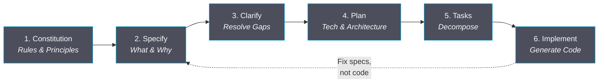

# Spec-Driven Development with AI

<p class="text-regent-secondary text-xl mt-4">Making intent the source of truth</p>

<p class="text-regent-secondary text-sm opacity-60 mt-auto">
  [Presenter Name] &middot; Regent All-Hands 2026
</p>

<!--
Welcome everyone. Today I'm going to talk about a fundamental shift in how we work with AI coding tools - moving from ad hoc prompting to structured, specification-driven development.
-->

---
transition: fade
---

# About Me

<div class="grid grid-cols-2 gap-8 mt-8">
<div>

- **[Your Name]**
- [Your Role] at Regent
- [Relevant experience]
- Passionate about developer productivity

</div>
<div class="flex items-center justify-center">
  
</div>
</div>

<!--
Brief intro - keep this to 30 seconds. Establish credibility for why you're presenting on this topic.
-->

---

# The Problem: Vibe Coding

<div class="mt-6">

<v-click>

> "Just prompt the AI and see what happens"

</v-click>

<v-click>

<div class="mt-8 grid grid-cols-2 gap-6">
<div class="p-4 rounded bg-regent-master">

### What we do now
- Open chat, start typing
- Hope the AI understands
- Fix what comes out
- Repeat until it works

</div>
<div class="p-4 rounded bg-regent-master">

### What actually happens
- Inconsistent architecture
- Contradicting implementations
- Context lost between sessions
- "It works but nobody knows why"

</div>
</div>

</v-click>

</div>

<!--
We've all been there. You open Copilot or Claude, type a prompt, and hope for the best. This is what the community calls "vibe coding" - development driven by intuition and hope rather than structured intent. The problem isn't the AI - it's our approach.
-->

---

# What Goes Wrong

<div class="mt-4">

````md magic-move
```markdown
# Prompt attempt 1
"Build me a user authentication system"
```
```markdown
# Prompt attempt 1
"Build me a user authentication system"

# AI generates... 500 lines of code
# - Uses JWT (you wanted sessions)
# - Adds OAuth (you didn't ask for it)
# - Skips rate limiting (you needed it)
# - No tests (you assumed it would)
```
```markdown
# Prompt attempt 2 (fixing attempt 1)
"Actually I wanted session-based auth, not JWT.
Also add rate limiting. And tests."

# AI generates... 400 different lines
# - Rewrites everything from scratch
# - New patterns, new structure
# - Previous context? Gone.
```
```markdown
# Prompt attempt 3...4...5...
# Each response diverges further
# Each fix introduces new assumptions
# The codebase becomes a patchwork
# of contradicting AI-generated patterns

# Total time: 3 hours
# Result: fragile, inconsistent code
# Confidence level: low
```
````

</div>

<!--
Watch this progression. First prompt is vague, so the AI makes assumptions. We correct it, but now it rewrites from scratch with NEW assumptions. Each iteration diverges further from our original intent. This is the fundamental problem: without a structured specification, the AI has no stable reference point.
-->

---

# A Better Way: Specification-Driven Development

<div class="mt-6 space-y-4">

<v-click>

**The core insight:** Don't tell the AI *how* to code. Tell it *what* you need and *why*.

</v-click>

<v-click>

<div class="p-6 rounded bg-regent-master border-l-4 border-regent-cyan mt-6">

### The Inversion

| Traditional | Spec-Driven |
|---|---|
| Code is the artifact | Specification is the artifact |
| Docs describe code | Specs generate code |
| Fix bugs in code | Fix bugs in specs |
| Refactor = rewrite code | Refactor = restructure specs |

</div>

</v-click>

<v-click>

> "Specifications become executable through AI, making intent the source of truth"

</v-click>

</div>

<!--
SDD flips the relationship. Instead of code being the primary artifact that we document after the fact, the SPECIFICATION becomes the primary artifact. Code is generated FROM specs. When something's wrong, you fix the spec, not the code. This is a profound shift.
-->

---

# What is spec-kit?

<div class="mt-2 space-y-2">

<v-click>

- **Open source toolkit** by GitHub (MIT license, released Sept 2025)
- Templates, CLI tools, and prompts for structured AI development

</v-click>

<v-click>

- Works with **any AI coding agent**: Copilot, Claude Code, Gemini CLI
- Three use cases: **greenfield** / **new features** / **legacy modernization**

</v-click>

<v-click>

<div class="mt-3 p-3 rounded bg-regent-master text-sm">

### What's in the box

| Component | Purpose |
|---|---|
| `/speckit.constitution` | Establish governing principles |
| `/speckit.specify` | Create structured specifications |
| `/speckit.clarify` | Resolve ambiguities |
| `/speckit.plan` | Generate technical plans |
| `/speckit.tasks` | Break down into actionable work |
| `/speckit.analyze` | Validate and review |

</div>

</v-click>

</div>

<!--
Spec-kit is GitHub's official open source toolkit for specification-driven development. It provides the templates, commands, and workflow structure to make SDD practical. It's not tied to one AI tool - it works with Copilot, Claude Code, Gemini CLI, and others. The six commands map to distinct phases that we'll walk through next.
-->

---

# The SDD Workflow

<div class="mt-2">



</div>

<v-click>

<div class="mt-4 text-center text-regent-secondary">

The feedback loop goes back to **specifications**, not to code.
<br/>When something's wrong, you fix the spec and regenerate.

</div>

</v-click>

<!--
Here's the full workflow visualized. Notice the feedback arrow - when implementation reveals a problem, you go back to the SPECIFICATION, not to the code. This is what makes the approach self-correcting. Each phase builds on the previous one, creating a traceable chain from intent to implementation.
-->

---

# Step 1: Constitution

<div class="mt-2">

> The governing principles that every specification must follow

<v-click>

<div class="mt-3 p-3 rounded bg-regent-master">

```markdown
# Project Constitution

## Article 1: Library-First Principle
All features must be implemented as standalone,
reusable libraries with clean public APIs.

## Article 2: Test-First Imperative [NON-NEGOTIABLE]
Tests must exist BEFORE implementation code.
No exceptions. No "we'll add tests later."

## Article 3: Simplicity
Choose the simplest solution that meets requirements.
Avoid premature abstraction.
```

</div>

</v-click>

<v-click>

<div class="mt-2 text-regent-secondary text-sm">

These are **immutable rules** - the AI must comply with every article. They prevent architectural drift across all generated code.

</div>

</v-click>

</div>

<!--
The constitution is your project's non-negotiable rules. Think of it like a real constitution - it governs everything that follows. You define principles like "all features are standalone libraries" or "tests must exist before implementation." The AI must comply with EVERY article. This prevents the architectural drift we see with vibe coding.
-->

---

# Step 2: Specify

<div class="mt-4">

> Focus on **WHAT** and **WHY** - never HOW

<v-click>

<div class="mt-4 p-4 rounded bg-regent-master">

```markdown
# Feature: User Authentication

## What
Users can sign in with email/password or SSO.
Sessions persist across browser restarts.
Failed attempts are rate-limited after 5 tries.

## Why
- Security: protect user accounts from unauthorized access
- UX: reduce friction for returning users
- Compliance: meet SOC2 audit requirements

## Acceptance Criteria
- [ ] Login with email/password works
- [ ] SSO redirects to provider and back
- [ ] Session persists for 30 days
- [ ] Rate limit kicks in after 5 failed attempts
```

</div>

</v-click>

</div>

<!--
Notice what's NOT here: no mention of JWT vs sessions, no database schemas, no framework choices. The specification captures INTENT - what the system should do and why. Technology decisions come later, in the planning phase. This separation is key - it prevents premature commitment to implementation details.
-->

---

# Step 3: Clarify

<div class="mt-2">

> Surface and resolve ambiguities **before** any code is written

<v-click>

<div class="mt-3 p-3 rounded bg-regent-master">

```markdown
# Clarification Report

## Resolved
- Q: What SSO providers?  A: Azure AD only (per IT policy)

## Needs Clarification
- [NEEDS CLARIFICATION] Password complexity rules?
  → Recommendation: NIST 800-63B (min 8 chars, no complexity rules)
- [NEEDS CLARIFICATION] Rate limit window - per IP or per account?
  → Recommendation: per account, 15-minute cooldown
- [NEEDS CLARIFICATION] Should locked accounts notify admins?
  → Recommendation: Yes, via existing alert channel
```

</div>

</v-click>

<v-click>

<div class="mt-2 text-regent-secondary text-sm">

The `[NEEDS CLARIFICATION]` markers are a **quality gate** - no planning begins until all ambiguities are resolved.

</div>

</v-click>

</div>

<!--
This is where spec-kit really shines. The clarify step forces you to confront ambiguities BEFORE writing any code. Those NEEDS CLARIFICATION markers act as a quality gate. The AI won't proceed to planning until they're all resolved. How many times have you started coding only to realize halfway through that the requirements were ambiguous? This step eliminates that.
-->

---

# Step 4: Plan

<div class="mt-2">

> NOW we talk technology - translate specs into architecture

<v-click>

<div class="mt-3 p-3 rounded bg-regent-master text-sm">

```markdown
# Technical Plan: User Authentication

## Architecture
- Session-based auth with Redis store
- Express middleware for route protection
- Azure AD SDK for SSO integration

## Components
1. AuthService - core auth logic (standalone library)
2. SessionStore - Redis-backed session management
3. RateLimiter - per-account attempt tracking
4. SSOBridge - Azure AD OAuth2 flow

## Dependencies
- express-session + connect-redis
- @azure/msal-node, rate-limiter-flexible

## Constitutional Compliance
✅ Art 1: Standalone libraries  ✅ Art 2: Test-first  ✅ Art 3: No custom crypto
```

</div>

</v-click>

</div>

<!--
NOW we bring in technology. The plan translates the specification into concrete architecture. Notice how it explicitly checks constitutional compliance at the bottom. Each component maps directly to a spec requirement. The tech choices are justified by the spec, not by personal preference or AI assumption. This is traceable, reviewable architecture.
-->

---

# Steps 5 & 6: Tasks and Implement

<div class="mt-2 grid grid-cols-2 gap-4">

<div>

### Decompose

<v-click>

```markdown
# Tasks (auto-generated from plan)

## Task 1: AuthService core
- Branch: feat/auth-service
- Tests: unit tests for login flow
- Deps: none
## Task 2: SessionStore
- Branch: feat/session-store
- Tests: integration with Redis
- Deps: Task 1
## Task 3: RateLimiter
- Branch: feat/rate-limiter
- Tests: attempt counting, cooldown
- Deps: Task 1
## Task 4: SSOBridge
- Branch: feat/sso-bridge
- Tests: OAuth2 flow mocks
- Deps: Task 1, Task 2
```

</v-click>

</div>

<div>

### Execute

<v-click>

<div class="space-y-2 mt-5">

<div class="p-2 rounded bg-regent-master border-l-4 border-[#0099CC] text-sm">
Task 1 is the foundation - runs first
</div>

<div class="p-2 rounded bg-regent-master border-l-4 border-[#3FCDFA] text-sm">
Tasks 2 & 3 can run <strong>in parallel</strong>
</div>

<div class="p-2 rounded bg-regent-master border-l-4 border-[#00ACE6] text-sm">
Task 4 depends on 1 + 2, runs last
</div>

<div class="mt-3 p-2 rounded bg-regent-master text-sm">

Each task:
- Has its own Git branch
- Includes tests (constitution!)
- Maps to one spec requirement
- Is independently reviewable

</div>

</div>

</v-click>

</div>

</div>

<!--
The plan is decomposed into tasks automatically. Each task gets its own branch, has explicit dependencies, and includes tests from day one - remember, the constitution demands it. Independent tasks can run in parallel - multiple AI agents working simultaneously. Each task is small enough to review confidently. This is where the structured approach pays dividends in speed.
-->

---

# A Spec Evolves

<div class="mt-2">

````md magic-move
```markdown
# Feature: User Authentication

## What
Users can sign in with email/password or SSO.
Sessions persist across browser restarts.
Failed attempts are rate-limited after 5 tries.
```
```markdown
# Technical Plan: User Authentication

## Architecture
- Session-based auth (Redis store)
- Express middleware for route protection
- Azure AD SDK for SSO

## Components
- AuthService → core logic (standalone library)
- SessionStore → Redis session management
- RateLimiter → per-account tracking
- SSOBridge → Azure AD OAuth2 flow
```
```markdown
# Task 1: AuthService Core

Branch: feat/auth-service
Status: ready

## Implementation
- src/lib/auth-service/index.ts
- src/lib/auth-service/auth-service.test.ts

## Acceptance
- [ ] Login with valid credentials returns session
- [ ] Login with invalid credentials returns error
- [ ] Matches spec: "Users can sign in with email/password"
```
````

</div>

<div class="mt-2 text-center text-regent-secondary text-sm">

Specification → Plan → Task: a traceable chain from intent to implementation

</div>

<!--
Watch the evolution. We start with a pure specification - what and why. It transforms into a technical plan with architecture decisions. Then it becomes a concrete task with test criteria that trace back to the original spec. Every line of code that gets generated can be traced back to a stated intent. This traceability is what makes SDD so powerful.
-->

---

# Code from Specs

<div class="mt-2">

````md magic-move
```markdown
## Acceptance Criteria
- [ ] Login with valid credentials returns session
- [ ] Login with invalid credentials returns error
- [ ] Rate limit after 5 failed attempts
```
```typescript
// auth-service.test.ts - Tests FIRST (constitutional mandate)

describe('AuthService', () => {
  it('returns session for valid credentials', async () => {
    const result = await authService.login('user@regent.se', 'valid')
    expect(result.session).toBeDefined()
    expect(result.session.expiresIn).toBe('30d')
  })

  it('returns error for invalid credentials', async () => {
    const result = await authService.login('user@regent.se', 'wrong')
    expect(result.error).toBe('INVALID_CREDENTIALS')
  })

  it('rate limits after 5 failed attempts', async () => {
    for (let i = 0; i < 5; i++) {
      await authService.login('user@regent.se', 'wrong')
    }
    const result = await authService.login('user@regent.se', 'wrong')
    expect(result.error).toBe('RATE_LIMITED')
  })
})
```
```typescript
// auth-service.ts - Implementation generated from spec + tests

export class AuthService {
  constructor(
    private readonly userStore: UserStore,
    private readonly sessionStore: SessionStore,
    private readonly rateLimiter: RateLimiter,
  ) {}

  async login(email: string, password: string): Promise<AuthResult> {
    if (await this.rateLimiter.isLimited(email)) {
      return { error: 'RATE_LIMITED' }
    }

    const user = await this.userStore.verify(email, password)
    if (!user) {
      await this.rateLimiter.recordFailure(email)
      return { error: 'INVALID_CREDENTIALS' }
    }

    const session = await this.sessionStore.create(user, { expiresIn: '30d' })
    return { session }
  }
}
```
````

</div>

<!--
Here's the magic. Acceptance criteria become tests - FIRST, because the constitution demands it. Tests define the contract. Only then does the implementation get generated. Every method, every branch, every error case traces back to a stated acceptance criterion which traces back to the original spec. When a test fails, you know EXACTLY which spec requirement is broken.
-->

---

# Use Cases

<div class="mt-6 grid grid-cols-3 gap-6">

<v-click>

<div class="p-6 rounded bg-regent-master text-center">

### Greenfield

<div class="text-4xl mt-4 mb-4">🏗️</div>

Start from scratch with
**full SDD workflow**

Constitution → Spec → Plan → Build

<div class="mt-4 text-regent-secondary text-sm">
Best for: new projects, POCs, hackathons
</div>

</div>

</v-click>

<v-click>

<div class="p-6 rounded bg-regent-master text-center">

### New Features

<div class="text-4xl mt-4 mb-4">✨</div>

Add to existing codebases
with **spec-first features**

Spec new feature → Plan within constraints → Build

<div class="mt-4 text-regent-secondary text-sm">
Best for: day-to-day feature work
</div>

</div>

</v-click>

<v-click>

<div class="p-6 rounded bg-regent-master text-center">

### Legacy Modernization

<div class="text-4xl mt-4 mb-4">🔄</div>

Spec the **desired state**,
plan the migration path

Analyze existing → Spec target → Plan migration

<div class="mt-4 text-regent-secondary text-sm">
Best for: refactoring, tech debt
</div>

</div>

</v-click>

</div>

<!--
Spec-kit isn't just for new projects. There are three primary use cases. Greenfield is obvious - start from scratch with the full workflow. But it's equally powerful for adding features to existing codebases, where you spec the new feature within existing constraints. And for legacy modernization, you spec the DESIRED state and plan the migration from current to target. That last one is particularly powerful for tackling tech debt.
-->

---

# The Paradigm Shift

<div class="flex flex-col items-center justify-center mt-12">

<v-click>

<div class="text-3xl font-bold text-regent-light mb-8 text-center leading-relaxed">
  "Intent is the source of truth.<br/>
  Code is a generated artifact."
</div>

</v-click>

<v-click>

<div class="grid grid-cols-3 gap-8 mt-4 text-center">

<div>
<div class="text-regent-bright text-lg font-bold">Debugging</div>
<div class="text-regent-secondary mt-2">Fix the spec,<br/>regenerate the code</div>
</div>

<div>
<div class="text-regent-bright text-lg font-bold">Refactoring</div>
<div class="text-regent-secondary mt-2">Restructure the spec,<br/>regenerate the code</div>
</div>

<div>
<div class="text-regent-bright text-lg font-bold">New Features</div>
<div class="text-regent-secondary mt-2">Extend the spec,<br/>regenerate the code</div>
</div>

</div>

</v-click>

</div>

<!--
This is the key takeaway. SDD represents a genuine paradigm shift. The specification - your INTENT - becomes the source of truth. Code becomes a generated, disposable artifact. Debugging? Fix the spec. Refactoring? Restructure the spec. New feature? Extend the spec. The AI regenerates the code. This is where software development is heading.
-->

---

# Getting Started

<div class="mt-6">

<v-click>

```bash
# Initialize spec-kit in any project
uvx --from spec-kit speckit init
```

</v-click>

<v-click>

<div class="mt-6 grid grid-cols-2 gap-6">
<div class="p-4 rounded bg-regent-master">

### First steps
1. Run `/speckit.constitution` to set up project rules
2. Run `/speckit.specify` for your first feature
3. Run `/speckit.clarify` to resolve ambiguities
4. Run `/speckit.plan` to create technical plan
5. Run `/speckit.tasks` to break down work
6. Let the AI implement from specs

</div>
<div class="p-4 rounded bg-regent-master">

### Resources
- **GitHub**: github.com/github/spec-kit
- **Docs**: Full quick-start guide included
- **Works with**: Copilot, Claude Code, Gemini CLI
- **License**: MIT (free and open source)

</div>
</div>

</v-click>

<v-click>

<div class="mt-6 text-center text-regent-secondary">

Try it on your next feature. Start small - even one spec is better than zero.

</div>

</v-click>

</div>

<!--
Getting started is simple. One command initializes spec-kit in your project. Then follow the six steps. My advice: start small. Pick ONE feature you're about to build and try spec-kit on it. You'll immediately feel the difference - clearer requirements, more consistent output, traceable decisions. The repo has a full quick-start guide and example project to follow along.
-->

---
layout: center
---

# Thank You

<div class="flex flex-col items-center mt-8">
  

  <div class="text-2xl text-regent-light mb-6">Questions?</div>

  <div class="text-regent-secondary space-y-2">
    <p>[Presenter Name] &middot; [presenter@regent.se]</p>
    <p class="text-sm">github.com/github/spec-kit</p>
  </div>
</div>

<!--
Thank you! I'm happy to take questions. If you want to try spec-kit, the GitHub repo has everything you need. I'm also happy to pair with anyone who wants to try it on a real feature. Let's move from vibe coding to spec-driven development.
-->
