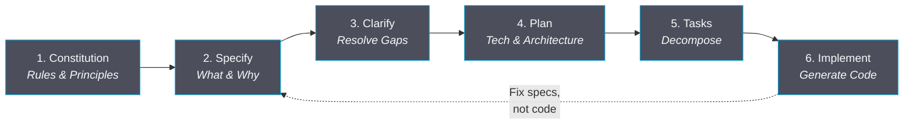
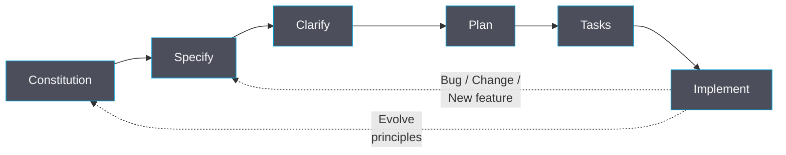

# Spec-Driven Development

<p class="text-regent-secondary text-xl mt-4">Making Intent the Source of Truth</p>

<p class="text-regent-secondary text-sm mt-6 opacity-80">CLAUDE.md rules and plan mode only get you so far.</p>

<p class="text-regent-secondary text-sm opacity-60 mt-auto">
  Mikael Pettersson &middot; Competence Conference 2026
</p>

<!--
Welcome everyone. Raise your hand if you use CLAUDE.md, .cursorrules, or some kind of rules file when working with AI. Great. And plan mode? Tickets? Good. You're already ahead of most teams. But today I want to talk about why those tools, as useful as they are, still leave a gap — and how we can close it.
-->

---

# Where We Are Today

<div class="mt-4">

<v-click>

<div class="grid grid-cols-3 gap-4">
<div class="p-4 rounded bg-regent-master">

### Rules files
<div class="text-regent-secondary text-sm mt-1">

CLAUDE.md, .cursorrules — tells AI **how** to code. Formatting, patterns, conventions.

</div>
</div>

<div class="p-4 rounded bg-regent-master">

### Plan mode
<div class="text-regent-secondary text-sm mt-1">

Think before coding. Better than raw prompting. But plans are **ephemeral** — gone next session.

</div>
</div>

<div class="p-4 rounded bg-regent-master">

### Tickets
<div class="text-regent-secondary text-sm mt-1">

Jira, GH Issues — tracks **work items**. But the AI interprets each ticket differently every time.

</div>
</div>

</div>

</v-click>

<v-click>

<div class="mt-4 p-4 rounded bg-regent-master border-l-4 border-regent-cyan">

### The gap

Rules tell the AI **how**. Tickets tell the AI **what** to work on. You can even add quality rules to CLAUDE.md — but enforcement is best-effort. Nothing **structurally ensures** the AI builds what you intended, with enforced compliance checks and traceability from intent to code.

</div>

</v-click>

</div>

<!--
Let's start with where we are. Most of us already use rules files — CLAUDE.md, .cursorrules. That's good. Some of us use plan mode. Even better. We have Jira tickets. All useful tools. And yes, you can put quality rules in your CLAUDE.md — "always write tests first", "never skip error handling." But here's the thing: the AI TRIES to follow those rules. It doesn't always succeed. There's no structural checkpoint that says "stop, you skipped the tests." Plan mode helps you think, but those plans vanish when the session ends. The gap isn't that these tools are bad — they're great. The gap is that nothing ENFORCES compliance and traces intent through to code.
-->

---

# The Decay Spiral

<div class="mt-4">

````md magic-move
```markdown
# Prompt attempt 1
"Build me a user authentication system"
```
```markdown
# Prompt attempt 1
"Build me a user authentication system"

# AI generates... 500 lines of code
# - Uses JWT (you wanted sessions)
# - Adds OAuth (you didn't ask for it)
# - Skips rate limiting (you needed it)
# - No tests (you assumed it would)
```
```markdown
# Prompt attempt 2 (fixing attempt 1)
"Actually I wanted session-based auth, not JWT.
Also add rate limiting. And tests."

# AI generates... 400 different lines
# - Rewrites everything from scratch
# - New patterns, new structure
# - Previous context? Gone.
```
```markdown
# Prompt attempt 3...4...5...
# Each response diverges further
# Each fix introduces new assumptions
# The codebase becomes a patchwork
# of contradicting AI-generated patterns

# Total time: 3 hours
# Result: fragile, inconsistent code
# Confidence level: low
```
````

</div>

<!--
This happens even if you have CLAUDE.md rules and plan mode. Watch: first prompt is vague, so the AI fills in the blanks. Your rules file tells it to use TypeScript and your preferred patterns — great. But it still chooses JWT when you wanted sessions, because rules don't capture INTENT. You correct it, but now it rewrites from scratch. Plan mode helped you think it through, but that plan is gone — the AI is guessing again. Each iteration diverges further. This isn't an AI problem or a tooling problem. It's a specification problem.
-->

---

# Why Now: Three Converging Trends

<div class="mt-4 grid grid-cols-3 gap-5">

<v-click>

<div class="p-4 rounded bg-regent-master">

### AI Capability Threshold

AI is now powerful enough to generate **the wrong thing at scale**.

<div class="text-regent-secondary text-sm mt-3">
A bad assumption at line 1 becomes 500 lines of confidently wrong code. The better the AI gets, the more dangerous unstructured prompting becomes.
</div>

</div>

</v-click>

<v-click>

<div class="p-4 rounded bg-regent-master">

### Exponential Complexity

Wrong assumptions **compound**.

<div class="text-regent-secondary text-sm mt-3">
One vague prompt creates an architecture. The next prompt builds on that architecture. By prompt 5, you're debugging a castle built on sand.
</div>

</div>

</v-click>

<v-click>

<div class="p-4 rounded bg-regent-master">

### Acceleration of Change

Codebases that can't be reasoned about **can't be adapted**.

<div class="text-regent-secondary text-sm mt-3">
When requirements change (and they will), vibe-coded systems resist modification because nobody — including the AI — understands the intent behind the code.
</div>

</div>

</v-click>

</div>

<!--
Why does this matter NOW, when we already have rules and plan mode? Three trends are converging. First, AI is powerful enough to generate complex systems — which means rules files alone can't prevent it from generating the WRONG complex system. Second, wrong assumptions compound. Plan mode helps once, but it doesn't persist or enforce. By your fifth session, you're debugging foundations nobody validated. Third: codebases that can't be reasoned about can't be adapted. When the client changes requirements — and they always do — you need more than rules. You need structured, enforceable specifications.
-->

---

# The Inversion

<div class="mt-3 space-y-3">

<v-click>

<div class="p-4 rounded bg-regent-master border-l-4 border-regent-cyan">

**The core insight:** Don't tell the AI *how* to code. Tell it *what* you need and *why*.

</div>

</v-click>

<v-click>

| Traditional | Spec-Driven |
|---|---|
| Code is the artifact | Specification is the artifact |
| Docs describe code | Specs generate code |
| Fix bugs in code | Fix bugs in specs |
| Refactor = rewrite code | Refactor = restructure specs |

</v-click>

<v-click>

<div class="grid grid-cols-3 gap-4 mt-2 text-center text-sm">

<div class="p-2 rounded bg-regent-master">
<div class="text-regent-bright font-bold">Debugging</div>
<div class="text-regent-secondary mt-1">Fix the spec, regenerate</div>
</div>

<div class="p-2 rounded bg-regent-master">
<div class="text-regent-bright font-bold">Refactoring</div>
<div class="text-regent-secondary mt-1">Restructure the spec, regenerate</div>
</div>

<div class="p-2 rounded bg-regent-master">
<div class="text-regent-bright font-bold">New Features</div>
<div class="text-regent-secondary mt-1">Extend the spec, regenerate</div>
</div>

</div>

</v-click>

</div>

<!--
This is the layer that sits above rules files and tickets. Rules tell the AI how to write code. Tickets tell it what to work on. But SDD flips the relationship entirely: the SPECIFICATION — your intent — becomes the primary artifact. Code is generated FROM specs. When something's wrong, you fix the spec, not the code. Your CLAUDE.md still governs style. Your tickets still track work. But the spec governs WHAT gets built and WHY. That's the missing layer.
-->

---

# What is spec-kit?

<div class="mt-2 space-y-2">

<v-click>

- **Open source toolkit** by GitHub (MIT license, released Sept 2025)
- Templates, CLI tools, and prompts for structured AI development

</v-click>

<v-click>

- Works with **any AI coding agent**: Copilot, Claude Code, Gemini CLI
- Three use cases: **greenfield** / **new features** / **legacy modernization**

</v-click>

<v-click>

<div class="mt-3 p-3 rounded bg-regent-master text-sm">

### What's in the box

| Component | Purpose |
|---|---|
| `/speckit.constitution` | Establish governing principles |
| `/speckit.specify` | Create structured specifications |
| `/speckit.clarify` | Resolve ambiguities |
| `/speckit.plan` | Generate technical plans |
| `/speckit.tasks` | Break down into actionable work |
| `/speckit.analyze` | Validate and review |

</div>

</v-click>

</div>

<!--
So how do you actually DO specification-driven development? This is where spec-kit comes in. It's GitHub's open source toolkit that provides the structure, commands, and quality gates. Think of it as the missing layer between your rules file and your tickets. It works with any AI tool — Copilot, Claude Code, Gemini CLI. Six commands, each mapping to a phase. Let me walk you through them.
-->

---

# "Can't I just use CLAUDE.md and Jira?"

<div class="mt-2">

<v-click>

<div class="grid grid-cols-3 gap-4 text-sm">

<div class="p-3 rounded bg-regent-master">

### Rules files
<div class="text-regent-secondary mt-1">

CLAUDE.md, .cursorrules, copilot-instructions...

- Tell AI **how** to code
- Can include quality rules
- But enforcement is **best-effort**
- AI may forget or deprioritize

</div>
</div>

<div class="p-3 rounded bg-regent-master">

### Tickets + Plan mode
<div class="text-regent-secondary mt-1">

Jira, GH Issues, plan mode...

- Describe **work items**
- Plans help thinking but are **ephemeral**
- AI interprets differently each time
- No structured validation step

</div>
</div>

<div class="p-3 rounded bg-regent-master border-l-4 border-regent-cyan">

### Spec-kit
<div class="text-regent-secondary mt-1">

Structured specification workflow

- Defines **what** and **why**
- Quality gates **block** bad specs
- Compliance checked at every step
- Traceable: intent → code

</div>
</div>

</div>

</v-click>

<v-click>

<div class="mt-3 p-3 rounded bg-regent-master border-l-4 border-regent-cyan text-sm">

**They're complementary, not competing.** Rules files set coding conventions. Tickets track work. Spec-kit sits *in between* — it's the structured bridge from intent to implementation that ensures the AI generates consistent, traceable code every time.

</div>

</v-click>

</div>

<!--
Let's go deeper on the gap. "Can't I just put quality gates in CLAUDE.md?" You can — and you should. But CLAUDE.md enforcement is best-effort. The AI TRIES to follow your rules, but nothing structurally blocks it from proceeding if it doesn't. In a long session, rules get deprioritized. There's no checkpoint that says "stop — you violated Article 2." Plan mode helps you think, but those plans vanish when the session ends. Spec-kit adds the missing structural layer: explicit compliance checks at every workflow step. It doesn't replace your rules file — it enforces the things your rules file can only ask for.
-->

---

# The SDD Workflow

<div class="mt-2">



</div>

<v-click>

<div class="mt-4 text-center text-regent-secondary">

The feedback loop goes back to **specifications**, not to code.
<br/>When something's wrong, you fix the spec and regenerate.

</div>

</v-click>

<!--
Here's the full workflow. Six steps, each building on the last. This is what plan mode WOULD be if plans persisted, had quality gates, and enforced constitutional compliance. Pay attention to that feedback arrow — it goes from implementation back to SPECIFY, not back to code. That arrow is what makes this the opposite of waterfall. In waterfall, you can't go back. In SDD, going back is the whole point — you iterate on specs, not on code.
-->

---

# The Constitution & the 9 Articles

<div class="mt-2">

> The governing principles that every specification must follow

<v-click>

<div class="mt-2 grid grid-cols-2 gap-3 text-sm">

<div>

```markdown
## Article 1: Library-First [NON-NEGOTIABLE]
All features as standalone, reusable
libraries with clean public APIs.

## Article 2: Test-First [NON-NEGOTIABLE]
Tests BEFORE implementation.
No exceptions. No "we'll add tests later."

## Article 3: Simplicity
Simplest solution that meets requirements.
Avoid premature abstraction.
```

</div>

<div>

```markdown
## Article 4: Single Responsibility
Each module does one thing well.
Clear boundaries, explicit contracts.

## Article 5: Documentation as Code
Every public API documented inline.
If it's not documented, it doesn't exist.

## Article 6: Error Boundaries [NON-NEGOTIABLE]
All external calls wrapped. No unhandled
exceptions. Fail gracefully, log clearly.
```

</div>

</div>

</v-click>

<v-click>

<div class="mt-2 p-2 rounded bg-regent-master border-l-4 border-regent-cyan text-sm">

**Quality gate:** The AI checks every spec and plan against every article. `[NON-NEGOTIABLE]` articles cause hard failures — the workflow stops until compliance is achieved.

</div>

</v-click>

</div>

<!--
The constitution is like CLAUDE.md's big sibling. Your rules file ASKS the AI to follow conventions. The constitution BLOCKS progress until compliance is achieved. Articles marked NON-NEGOTIABLE are hard quality gates — the AI cannot proceed if a spec violates them. This is the difference between "please follow these guidelines" and "the system enforces these rules." Your CLAUDE.md says "write tests." The constitution says "no tests, no progress."
-->

---

# From Intent to Architecture

<div class="mt-2">

````md magic-move
```markdown
# Step 1: Specify — What & Why, never How

## Feature: User Authentication

### What
- Sign in with email/password or SSO
- Sessions persist across restarts
- Rate-limited after 5 failed attempts

### Why
- Security: protect user accounts
- UX: reduce return-user friction
- Compliance: SOC2 requirements
```
```markdown
# Step 2: Clarify — Surface every ambiguity

## Clarification Report

### Resolved
- SSO: Azure AD only (IT policy)

### [NEEDS CLARIFICATION]
- Password rules?
  → Rec: NIST 800-63B
- Rate limit: per IP or account?
  → Rec: per account, 15min lockout
- Locked accounts notify admins?
  → Rec: Yes, use existing alert system
```
```markdown
# Step 3: Plan — NOW we talk technology

## Technical Plan

### Architecture
- Session-based auth (Redis store)
- Express middleware pipeline
- Azure AD SDK for SSO integration

### Constitutional Compliance
✅ Article 1: Standalone libraries
✅ Article 2: Test-first development
✅ Article 3: Simplest approach
✅ Article 6: Error boundaries
```
````

</div>

<div class="mt-2 text-center text-regent-secondary text-sm italic">
15 minutes of specification prevents 3 hours of rework.
</div>

<!--
Here's the middle three steps in action. Watch the progression. SPECIFY captures pure intent — what and why, never how. CLARIFY forces you to confront every ambiguity BEFORE code. Those NEEDS CLARIFICATION markers are quality gates — no planning until they're resolved. Only in PLAN do we bring in technology. Notice the constitutional compliance check at the bottom — every plan is validated against the constitution. This whole process takes about 15 minutes. Compare that to 3 hours of prompt-and-pray.
-->

---

# Tasks: Parallel & Traceable

<div class="mt-2 grid grid-cols-2 gap-4">

<div>

<v-click>

```markdown
# Tasks (from plan)

## Task 1: AuthService core
- Branch: feat/auth-service
- Tests: unit tests for login flow
- Constitutional: Art 1, 2, 6
- Deps: none

## Task 2: SessionStore
- Branch: feat/session-store
- Tests: integration with Redis
- Deps: Task 1

## Task 3: RateLimiter
- Branch: feat/rate-limiter
- Tests: attempt counting, cooldown
- Deps: Task 1

## Task 4: SSOBridge
- Branch: feat/sso-bridge
- Tests: OAuth2 flow mocks
- Deps: Task 1, Task 2
```

</v-click>

</div>

<div>

<v-click>

<div class="space-y-3 mt-1">

- **Dependency-aware** — Task 1 runs first as foundation

- **Parallel execution** — Tasks 2 & 3 run simultaneously, two AI agents on separate branches

- **Isolated & reviewable** — each task on its own branch with its own tests

- **Fully traceable** — every task maps back through spec → constitution → tests → code

</div>

</v-click>

</div>

</div>

<!--
Tasks are auto-generated from the plan, each with its own Git branch, dependency graph, and test requirements. Independent tasks can run in parallel — two AI agents on separate branches, no conflicts. Each task maps back to the spec, which maps back to the constitution. This traceability is what makes the code reviewable. When you review a PR, you can see WHY the code exists, not just WHAT it does.
-->

---

# From Spec to Working Code

<div class="mt-2">

````md magic-move
```markdown
## Acceptance Criteria
- [ ] Login with valid credentials returns session
- [ ] Login with invalid credentials returns error
- [ ] Rate limit after 5 failed attempts
- [ ] Session persists for 30 days
```
```typescript
// auth-service.test.ts — Tests FIRST (constitutional mandate)

describe('AuthService', () => {
  it('returns session for valid credentials', async () => {
    const result = await authService.login('user@regent.se', 'valid')
    expect(result.session).toBeDefined()
    expect(result.session.expiresIn).toBe('30d')
  })

  it('returns error for invalid credentials', async () => {
    const result = await authService.login('user@regent.se', 'wrong')
    expect(result.error).toBe('INVALID_CREDENTIALS')
  })

  it('rate limits after 5 failed attempts', async () => {
    for (let i = 0; i < 5; i++) {
      await authService.login('user@regent.se', 'wrong')
    }
    const result = await authService.login('user@regent.se', 'wrong')
    expect(result.error).toBe('RATE_LIMITED')
  })
})
```
```typescript
// auth-service.ts — Implementation generated from spec + tests

export class AuthService {
  constructor(
    private readonly userStore: UserStore,
    private readonly sessionStore: SessionStore,
    private readonly rateLimiter: RateLimiter,
  ) {}

  async login(email: string, password: string): Promise<AuthResult> {
    if (await this.rateLimiter.isLimited(email)) {
      return { error: 'RATE_LIMITED' }
    }

    const user = await this.userStore.verify(email, password)
    if (!user) {
      await this.rateLimiter.recordFailure(email)
      return { error: 'INVALID_CREDENTIALS' }
    }

    const session = await this.sessionStore.create(user, { expiresIn: '30d' })
    return { session }
  }
}
```
````

</div>

<div class="mt-1 text-center text-regent-secondary text-sm">

Acceptance Criteria → Tests FIRST → Implementation. Every line traceable to intent.

</div>

<!--
Here's the magic. Acceptance criteria from the spec become tests — FIRST, because the constitution demands it. Tests define the contract. Only then does the implementation get generated. Every method, every branch, every error case traces back to a stated acceptance criterion which traces back to the original spec. When a test fails, you know EXACTLY which spec requirement is broken. This is the chain: intent → spec → test → code.
-->

---

# "This is just waterfall"

<div class="mt-4 grid grid-cols-2 gap-6">

<v-click>

<div class="p-4 rounded bg-regent-master">

### Waterfall

- Specs written once, frozen
- Change = rewrite the project plan
- Months between spec and code
- Feedback loop: **none**
- "We'll test at the end"

<div class="mt-3 text-regent-secondary text-sm italic">
Designed for a world where changing direction was expensive.
</div>

</div>

</v-click>

<v-click>

<div class="p-4 rounded bg-regent-master border-l-4 border-regent-cyan">

### Specification-Driven Development

- Specs are **living documents**
- Change = update spec, regenerate
- Minutes between spec and code
- Feedback loop: **continuous**
- "Tests are generated FIRST"

<div class="mt-3 text-regent-secondary text-sm italic">
Designed for a world where AI makes changing direction cheap.
</div>

</div>

</v-click>

</div>

<v-click>

<div class="mt-4 text-center">

Changing a spec in waterfall meant **rewriting the project plan**.
<br/>In SDD, it means **re-running a command**.

</div>

</v-click>

<!--
This is the number one objection, so let's address it head-on. Waterfall and SDD both start with specifications, but that's where the similarity ends. Waterfall specs are frozen — changing them is expensive and political. SDD specs are living documents — changing them is literally the workflow. The feedback arrow on the workflow diagram? That's the opposite of waterfall. Waterfall says "don't go back." SDD says "going back is cheap, so do it early and often."
-->

---

# "This slows us down"

<div class="mt-6 space-y-4">

<v-click>

<div class="text-xl text-center">
Vibe coding is fast — until it isn't.
</div>

</v-click>

<v-click>

<div class="grid grid-cols-2 gap-6 mt-4">

<div class="p-4 rounded bg-regent-master text-center">

### Vibe Coding

<div class="text-3xl font-bold text-red-400 mt-2">~3 hours</div>

<div class="text-regent-secondary text-sm mt-2">
Prompt → fix → re-prompt → fix<br/>
→ realize assumptions were wrong<br/>
→ start over → fix → ship with doubt
</div>

</div>

<div class="p-4 rounded bg-regent-master text-center border-l-4 border-regent-cyan">

### Spec-Driven

<div class="text-3xl font-bold text-green-400 mt-2">~45 minutes</div>

<div class="text-regent-secondary text-sm mt-2">
15 min spec → 5 min clarify<br/>
→ 5 min plan → generate<br/>
→ review traceable code → ship with confidence
</div>

</div>

</div>

</v-click>

<v-click>

<div class="mt-4 text-center text-regent-secondary italic">
Remember the decay spiral? 15 minutes of specification prevents that entire cycle.
</div>

</v-click>

</div>

<!--
"But writing specs takes time!" Yes, about 15 minutes. Compare that to the decay spiral we saw earlier - 3 hours of prompt, fix, re-prompt, hope. The spec pays for itself on the first feature. And it compounds: the second feature is faster because the constitution already exists. The third feature is faster because patterns are established. Vibe coding has constant cost. SDD has decreasing cost over time.
-->

---

# "AI is good enough without this"

<div class="mt-6 space-y-4">

<v-click>

<div class="p-4 rounded bg-regent-master border-l-4 border-regent-cyan">
<div class="text-lg">

A powerful tool with vague instructions is a **liability**, not a productivity boost.

</div>
</div>

</v-click>

<v-click>

<div class="grid grid-cols-2 gap-6 mt-2">

<div class="p-4 rounded bg-regent-master">

### What AI excels at
- Generating code from clear specs
- Following established patterns
- Maintaining consistency within constraints
- Translating intent into implementation

</div>

<div class="p-4 rounded bg-regent-master">

### What AI cannot do
- Read your mind
- Maintain context across sessions
- Self-correct without a reference point
- Know your project's non-negotiables

</div>

</div>

</v-click>

<v-click>

<div class="mt-3 text-center text-regent-secondary">
SDD doesn't replace AI capability — it <strong>channels</strong> it.<br/>
The better the AI gets, the more valuable structured specifications become.
</div>

</v-click>

</div>

<!--
"AI is getting so good, I don't need all this structure." Here's the thing: the better AI gets at generating code, the MORE important it is to give it the right instructions. Remember the three converging trends? A powerful tool with vague instructions generates wrong things at scale. SDD doesn't slow the AI down — it channels its power. Think of it this way: a race car without a steering wheel is just a very fast way to crash.
-->

---

# "What about when requirements change?"

<div class="mt-6 space-y-4">

<v-click>

<div class="grid grid-cols-2 gap-6">

<div class="p-4 rounded bg-regent-master">

### Without SDD

- Requirements change...
- Prompt the AI to update the feature
- AI loses context from the original implementation
- New output contradicts previous patterns
- Prompt again to fix the conflicts
- Repeat until it "looks right"
- No way to verify nothing else broke

<div class="text-regent-secondary text-sm mt-2 italic">
Re-prompt and hope.
</div>

</div>

<div class="p-4 rounded bg-regent-master border-l-4 border-regent-cyan">

### With SDD

- Requirements change...
- Update the specification
- Re-run `/speckit.clarify`
- Re-run `/speckit.plan`
- Re-run `/speckit.tasks`
- AI regenerates from updated spec
- Tests validate the change

<div class="text-regent-secondary text-sm mt-2 italic">
Update the spec, not patch the code.
</div>

</div>

</div>

</v-click>

<v-click>

<div class="mt-3 p-3 rounded bg-regent-master border-l-4 border-regent-cyan text-sm">

**This is the killer feature.** Because the spec is the source of truth, requirement changes propagate cleanly. The constitution ensures the change doesn't violate your project's principles. The tests ensure the change actually works.

</div>

</v-click>

</div>

<!--
Requirements WILL change. That's not a question. The question is: how painful is it when they do? Without SDD, you're patching code and hoping. With SDD, you update the spec and the changes propagate through the entire chain - new plan, new tasks, new code, new tests. The constitution catches any violations. The tests validate the change. It's not that SDD prevents change — it EMBRACES it by making change cheap and safe.
-->

---

# Where SDD Transforms Work

<div class="mt-3 grid grid-cols-2 gap-4 text-sm">

<v-click>

<div class="p-3 rounded bg-regent-master">

### Debugging
<div class="text-regent-secondary text-xs mt-1">Bug found in AI-generated code</div>

<div class="mt-2"><span class="text-red-400 font-bold">Before:</span> Which prompt produced this? What was the intent? Re-prompt to fix, hope it doesn't break something else.</div>
<div class="mt-2"><span class="text-regent-bright font-bold">After:</span> Trace the bug to a spec requirement. Fix the spec. Regenerate. Tests confirm the fix.</div>

</div>

</v-click>

<v-click>

<div class="p-3 rounded bg-regent-master">

### Refactoring
<div class="text-regent-secondary text-xs mt-1">Architecture needs to change</div>

<div class="mt-2"><span class="text-red-400 font-bold">Before:</span> Prompt the AI to restructure. It loses the original constraints. New architecture, new inconsistencies.</div>
<div class="mt-2"><span class="text-regent-bright font-bold">After:</span> Update the spec. Constitution enforces constraints. Regenerate from source of truth.</div>

</div>

</v-click>

<v-click>

<div class="p-3 rounded bg-regent-master">

### Client Handoffs
<div class="text-regent-secondary text-xs mt-1">Project transitions to another team</div>

<div class="mt-2"><span class="text-red-400 font-bold">Before:</span> "Here's the repo." New team's AI immediately generates conflicting patterns. Knowledge walks out the door.</div>
<div class="mt-2"><span class="text-regent-bright font-bold">After:</span> Hand off specs + constitution. New team's AI follows the same rules from day one.</div>

</div>

</v-click>

<v-click>

<div class="p-3 rounded bg-regent-master">

### Legacy Modernization
<div class="text-regent-secondary text-xs mt-1">Existing codebase needs updating</div>

<div class="mt-2"><span class="text-red-400 font-bold">Before:</span> No one remembers why it was built this way. AI guesses at intent, adds new assumptions on top of old ones.</div>
<div class="mt-2"><span class="text-regent-bright font-bold">After:</span> Spec the desired state. AI migrates with clear intent. Constitution prevents old anti-patterns.</div>

</div>

</v-click>

</div>

<!--
Let's talk about where this hits hardest for us at Regent. Debugging: instead of reading 500 lines of AI-generated code, read the spec and find the mismatch. Refactoring: restructure the spec and regenerate. Client handoffs — this is huge for consulting — hand off the specs AND the constitution. The client's AI follows your rules, not just their next prompt. And legacy modernization: spec the target state, plan the migration, and the constitution prevents old anti-patterns from creeping back in.
-->

---

# The SDD Lifecycle

<div class="mt-2">



</div>

<div class="mt-2 text-center text-regent-secondary text-sm">

SDD is a <strong>continuous cycle</strong>, not a one-time process. Every change feeds back into specifications.

</div>

<!--
This is the full lifecycle. Notice it's a cycle, not a pipeline. Requirements change? Go back to Specify. Bug found? Go back to Specify. New feature? Go back to Specify. Even the constitution evolves — as your project matures, you add or refine articles. This is the visual proof that SDD is the opposite of waterfall. It's designed to be iterative, continuous, and responsive to change.
-->

---

# Getting Started

<div class="mt-4">

<v-click>

```bash
# Initialize spec-kit in any project
uvx --from spec-kit speckit init
```

</v-click>

<v-click>

<div class="mt-4 grid grid-cols-2 gap-6">
<div class="p-4 rounded bg-regent-master">

### First steps
1. Run `/speckit.constitution` to set up project rules
2. Run `/speckit.specify` for your first feature
3. Run `/speckit.clarify` to resolve ambiguities
4. Run `/speckit.plan` to create technical plan
5. Run `/speckit.tasks` to break down work
6. Let the AI implement from specs

</div>
<div class="p-4 rounded bg-regent-master">

### Resources
- **GitHub**: github.com/github/spec-kit
- **Docs**: Full quick-start guide included
- **Works with**: Copilot, Claude Code, Gemini CLI
- **License**: MIT (free and open source)

</div>
</div>

</v-click>

<v-click>

<div class="mt-4 text-center text-regent-secondary">

Start small: pick **one feature** and try the full workflow. You'll feel the difference immediately.

</div>

</v-click>

</div>

<!--
Getting started is simple. One command initializes spec-kit in your project. Then follow the six steps. My advice: start small. Pick ONE feature you're about to build and try spec-kit on it. You'll immediately feel the difference - clearer requirements, more consistent output, traceable decisions. The repo has a full quick-start guide and example project.
-->

---
layout: center
---

# One Thing to Try This Week

<div class="flex flex-col items-center mt-12">

<div class="text-2xl text-regent-light leading-relaxed text-center max-w-xl">
Before your next feature, spend <strong class="text-regent-bright">10 minutes</strong> writing a spec.
</div>

<div class="mt-8 text-xl text-regent-secondary text-center">
Just the <strong>What</strong> and <strong>Why</strong>. No How.
</div>

<v-click>

<div class="mt-8 text-regent-secondary text-sm opacity-70">
That's it. See what changes.
</div>

</v-click>

</div>

<!--
I'm not asking you to adopt a whole new methodology overnight. I'm asking for 10 minutes. Before your next feature, write down what it should do and why. Not how - just what and why. See how it changes the conversation with the AI. See how it changes the output. If it makes a difference - and I believe it will - then try the full workflow next time.
-->

---
layout: center
---

# Thank You

<div class="flex flex-col items-center mt-8">
  

  <div class="text-2xl text-regent-light mb-6">Questions?</div>

  <div class="text-regent-secondary space-y-2">
    <p>Mikael Pettersson &middot; mikael.pettersson@regent.se</p>
    <p class="text-sm">github.com/github/spec-kit</p>
  </div>
</div>

<!--
Thank you! I'm happy to take questions. If you want to try spec-kit, the GitHub repo has everything you need. I'm also happy to pair with anyone who wants to try it on a real feature. Let's move from vibe coding to spec-driven development.
-->
